# LipFD 轻量化实验结果

更新时间：2026-05-24

本文档只保留真实运行结果、图像、结论和下一步路线。早期空模板、`待测量`、`待填写` 内容已删除。

重要约束：

- 不要随便改 `data/datasets.py` 的输入预处理语义。
- 尤其不要改颜色通道、像素范围、归一化方式、1000x2500 大图结构。
- 之前错误预处理会导致模型几乎全部判断为 real，验证结果严重失真。
- 后续轻量化代码尽量放在 `lightweight/` 下。

---

## 1. 当前推荐方案

当前最推荐的轻量化模型是：

```text
CLIP: ViT-B/32
Region Awareness: ResNet18
ra_loss_weight: 0.01
checkpoint: lightweight/results/checkpoints/region_resnet18_clip_b32_ra0p01/best.pth
```

核心结果：

| Model | Params | Acc | AP | FPR | FNR | Synthetic bs=1 FPS | Val E2E FPS |
|---|---:|---:|---:|---:|---:|---:|---:|
| Official ViT-L/14 + ResNet50 | 451.1304M | 0.9372 | 0.9828 | 0.0303 | 0.0960 | 10.13 | 34.18 |
| ViT-B/32 + ResNet18 ra0p01 | 162.4561M | 0.9266 | 0.9779 | 0.0896 | 0.0569 | 23.85 | 43.35 |

结论：

- 参数量减少约 64.0%。
- 合成单样本前向从 10.13 FPS 提升到 23.85 FPS，约 2.35x。
- 完整验证集端到端吞吐从 34.18 FPS 提升到 43.35 FPS，约 1.27x。
- 模型传输 + 前向时间从 26.58 ms/sample 降到 8.43 ms/sample，约 3.15x。
- Acc 比官方原模型低约 1.06 个百分点。
- FNR 从 0.0960 降到 0.0569，fake 漏检减少。
- FPR 从 0.0303 升到 0.0896，real 误报为 fake 增多，这是当前主要精度代价。

当前方向判断：

```text
模型侧已经有明显收益；
真实视频系统下一步主要优化预处理链路，而不是继续盲目换更小模型。
```

---

## 2. 数据与基线确认

### 2.1 官方预处理数据确认

官方预处理逻辑来自 `preprocess.py`：

```text
video + wav
-> librosa.load 默认 22050 Hz
-> melspectrogram
-> plt.imsave / plt.imread
-> cv2.COLOR_BGR2RGBA
-> frame resize 500x500
-> mel 上半部分 + 5 帧下半部分
-> 1000x2500 PNG
```

官方验证集路径：

```text
datasets/val/0_real
datasets/val/1_fake
```

验证集样本数：

```text
real: 1719
fake: 1687
total: 3406
```

### 2.2 官方原模型结果

官方 ckpt：

```text
checkpoints/ckpt.pth
```

官方原模型在官方验证集上的结果：

| Metric | Value |
|---|---:|
| Acc | 0.9371697005 |
| AP continuous | 0.9828436039 |
| AP thresholded like official validate.py | 0.9217271121 |
| FPR | 0.0302501454 |
| FNR | 0.0960284529 |
| TP | 1525 |
| TN | 1667 |
| FP | 52 |
| FN | 162 |

官方原模型在重新按官方逻辑处理后的训练集上推理：

```text
acc: 0.8194027887
ap: 0.8450652325
fpr: 0.0213486455
fnr: 0.3091773657
```

这个结果说明：当前重新处理后的数据与官方权重是基本匹配的，之前异常结果主要来自错误预处理。

---

## 3. 探索过程总览

| Step | Experiment | Result | Decision |
|---:|---|---|---|
| 1 | Official ViT-L/14 + ResNet50 | Acc 0.9372，参数 451.13M，bs=1 10.13 FPS | 原始基线 |
| 2 | ResNet50 -> ResNet18, ra_loss_weight=1 | Acc 0.8764，FPR 0.1966，RA loss 长期不降 | 速度有收益，精度不够 |
| 3 | ResNet50 -> ResNet34, ra_loss_weight=1 | Best Acc 0.8156，效果比 ResNet18 差 | 放弃 |
| 4 | ResNet18, ra_loss_weight=0.1 | Best Acc 0.8834，AP 0.9711，FPR 0.1955 | 有改善但 FPR 高 |
| 5 | ResNet18, ra_loss_weight=0.01 | Best Acc 0.9181，AP 0.9787，FPR/FNR 更均衡 | ViT-L 主线最佳 |
| 6 | ViT-B/16 + ResNet18, ra0p01 | Acc 0.9228，FNR 低但 FPR 偏高 | 低漏检候选 |
| 7 | ViT-B/32 + ResNet18, ra0p01 | Acc 0.9266，参数大幅下降，最均衡 | 当前主线 |
| 8 | DataLoader 扫描 | workers=12, prefetch=4 最快 | 固化验证推理参数 |
| 9 | 真实视频端到端测速初版 | 11.79 windows/s，但 transform 路径不是严格 dataset-like | 仅作探索参考 |
| 10 | 官方 PNG vs 内存路径等价性检查 | dataset-like 内存路径 max diff=0，score diff=0 | 可安全切换真实视频脚本 |
| 11 | dataset-like 真实视频测速 | 8.83 windows/s，严格匹配当前 `data/datasets.py` | 作为真实视频新基线 |
| 12 | 直接 BGR tensor 路径 | 11.44 windows/s，max diff=0，score diff=0 | 当前真实视频最快可信路径 |
| 13 | 复用 frame tensor + 直接 crops | 13.06 windows/s，max diff=0，score diff=0 | 当前最快可信路径 |

---

## 4. 原始模型性能

### 4.1 参数量

结果文件：

```text
lightweight/results/original_params.json
```

| Item | Value |
|---|---:|
| Total params | 451.130407M |
| CLIP encoder params | 427.616513M |
| Region Awareness params | 23.513666M |
| Conv1 params | 228 |
| Checkpoint size | 1721.44 MB |

### 4.2 合成前向速度

结果文件：

```text
lightweight/results/original_speed.json
```

| Batch Size | Mean ms/batch | Latency ms/sample | Throughput |
|---:|---:|---:|---:|
| 1 | 98.71 | 98.71 | 10.13 samples/s |
| 4 | 132.62 | 33.16 | 30.16 samples/s |
| 8 | 190.14 | 23.77 | 42.07 samples/s |
| 16 | 357.64 | 22.35 | 44.74 samples/s |

### 4.3 完整验证集端到端速度

结果文件：

```text
lightweight/results/checkpoints/original_e2e_val_benchmark.json
```

配置：

```text
batch_size: 16
num_workers: 12
prefetch_factor: 4
samples: 3406
batches: 213
```

| Item | Value |
|---|---:|
| Total time including metrics | 99.6484 s |
| FPS including metrics | 34.1802 samples/s |
| Total ms/sample | 29.2567 ms |
| Data wait ms/sample | 2.3846 ms |
| Transfer + forward ms/sample | 26.5812 ms |

---

## 5. ResNet 分支替换实验

### 5.1 ResNet18 + ViT-L/14 + ra_loss_weight=1

结果目录：

```text
lightweight/results/checkpoints/region_resnet18_official_preprocess_ra1
```

曲线图：

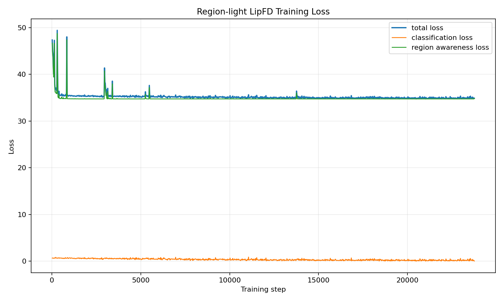

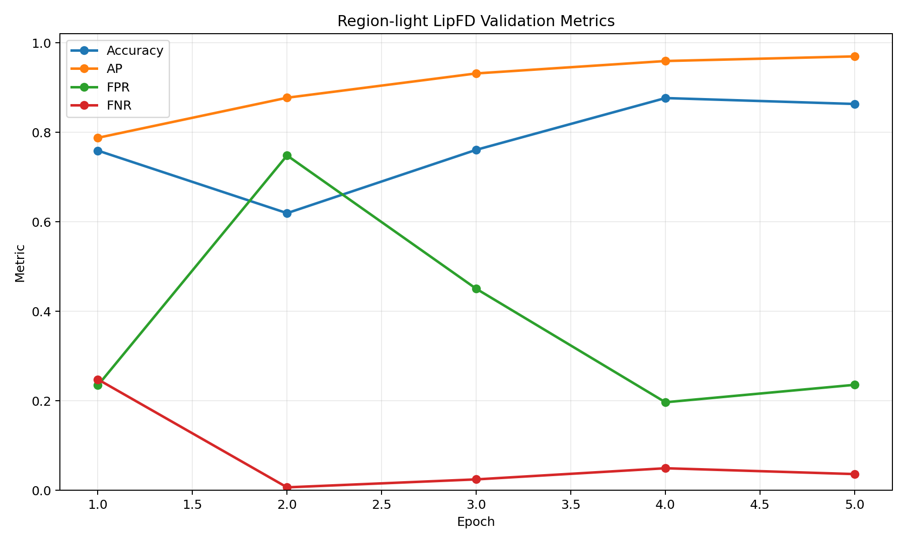

每轮验证：

| Epoch | Train Loss Mean | Acc | AP | FPR | FNR |
|---:|---:|---:|---:|---:|---:|
| 1 | 35.8367 | 0.7590 | 0.7876 | 0.2344 | 0.2478 |
| 2 | 35.2081 | 0.6192 | 0.8771 | 0.7481 | 0.0065 |
| 3 | 35.0682 | 0.7607 | 0.9314 | 0.4503 | 0.0243 |
| 4 | 34.9839 | 0.8764 | 0.9591 | 0.1966 | 0.0492 |
| 5 | 34.9332 | 0.8632 | 0.9695 | 0.2356 | 0.0362 |

参数与速度：

```text
total_params: 438.795815M
encoder_params: 427.616513M
backbone_params: 11.179074M
bs=1 synthetic: 45.25 ms, 22.10 FPS
bs=16 synthetic: 241.92 ms/batch, 66.14 samples/s
```

结论：

- ResNet18 明显减少 Region 分支计算。
- 但 `ra_loss_weight=1` 时 total loss 长期在 35 左右，RA loss 主导训练，分类校准不稳定。
- 因此后续转向降低 RA loss 权重。

### 5.2 ResNet34 + ViT-L/14 + ra_loss_weight=1

结果目录：

```text
lightweight/results/checkpoints/region_resnet34_official_preprocess_ra1
```

曲线图：

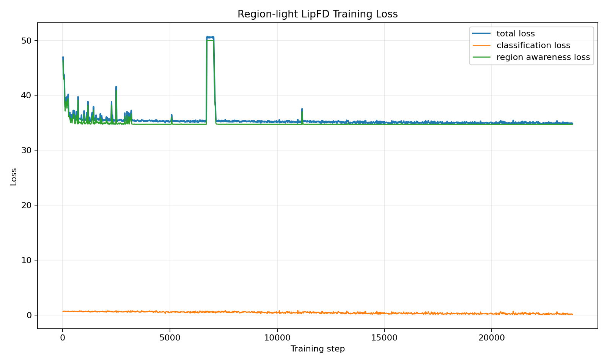

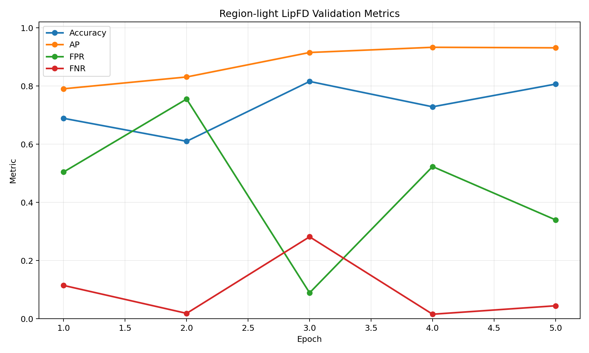

每轮验证：

| Epoch | Train Loss Mean | Acc | AP | FPR | FNR |
|---:|---:|---:|---:|---:|---:|
| 1 | 35.9546 | 0.6888 | 0.7903 | 0.5044 | 0.1144 |
| 2 | 36.4792 | 0.6098 | 0.8309 | 0.7551 | 0.0184 |
| 3 | 35.1880 | 0.8156 | 0.9151 | 0.0890 | 0.2816 |
| 4 | 35.0465 | 0.7284 | 0.9330 | 0.5230 | 0.0154 |
| 5 | 34.9784 | 0.8065 | 0.9311 | 0.3397 | 0.0445 |

结论：

- ResNet34 参数和计算比 ResNet18 更大，但没有带来更好效果。
- 更大的随机初始化分支在当前训练策略下反而更难校准。
- 同样受 `ra_loss_weight=1` 影响，loss 与验证指标都不稳定。
- 因此 ResNet34 不作为主线。

---

## 6. RA Loss 权重实验

### 6.1 ResNet18 + ra_loss_weight=0.1

结果目录：

```text
lightweight/results/checkpoints/region_resnet18_official_preprocess_ra0p1
```

曲线图：

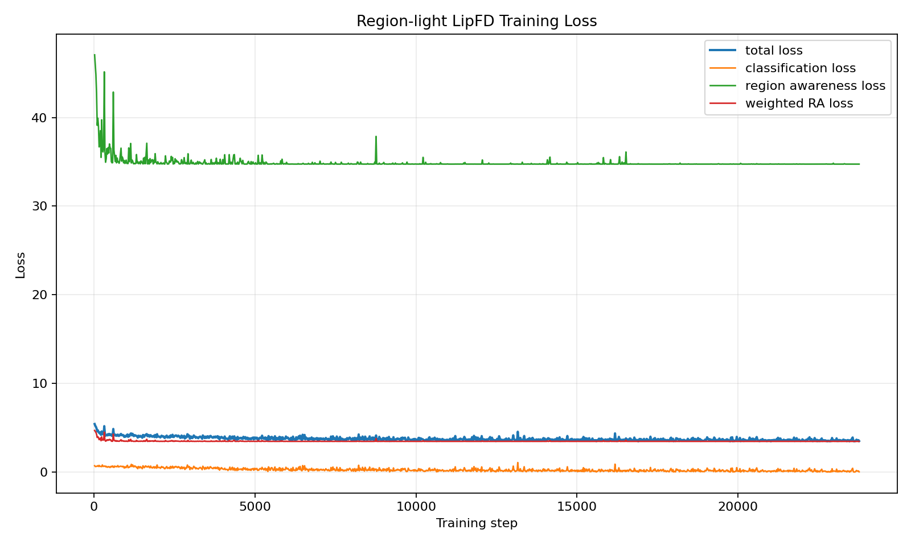

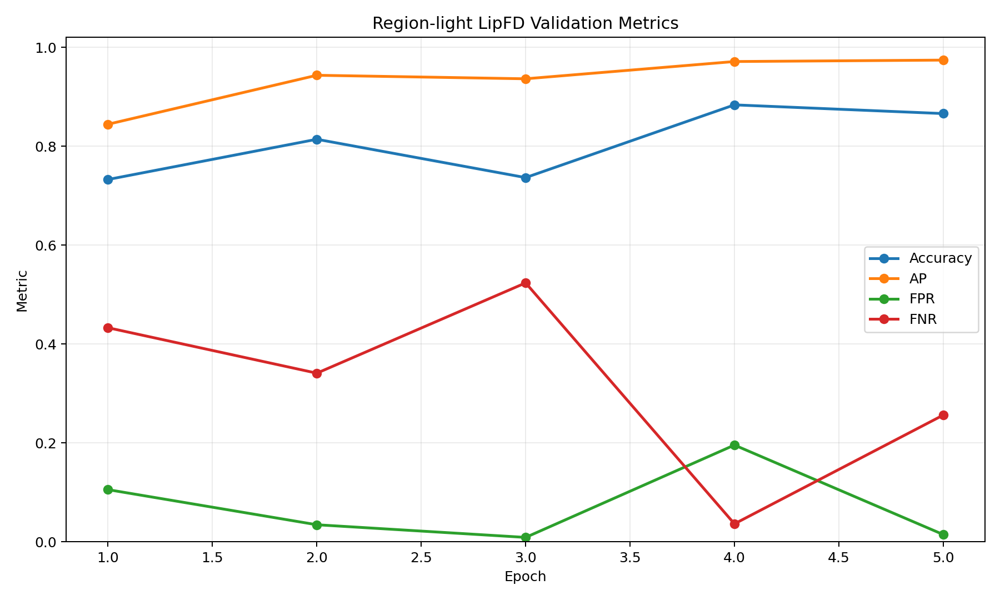

每轮验证：

| Epoch | Train Loss Mean | Acc | AP | FPR | FNR |
|---:|---:|---:|---:|---:|---:|
| 1 | 4.0710 | 0.7325 | 0.8443 | 0.1053 | 0.4327 |
| 2 | 3.7880 | 0.8139 | 0.9433 | 0.0343 | 0.3408 |
| 3 | 3.6987 | 0.7363 | 0.9362 | 0.0087 | 0.5234 |
| 4 | 3.6511 | 0.8834 | 0.9711 | 0.1955 | 0.0362 |
| 5 | 3.6218 | 0.8658 | 0.9740 | 0.0145 | 0.2561 |

结论：

- Loss 数值明显下降，说明降低 RA loss 权重有效。
- 但 FPR/FNR 波动仍大，阈值 0.5 下校准不够稳定。

### 6.2 ResNet18 + ra_loss_weight=0.01

结果目录：

```text
lightweight/results/checkpoints/region_resnet18_official_preprocess_ra0p01
```

曲线图：

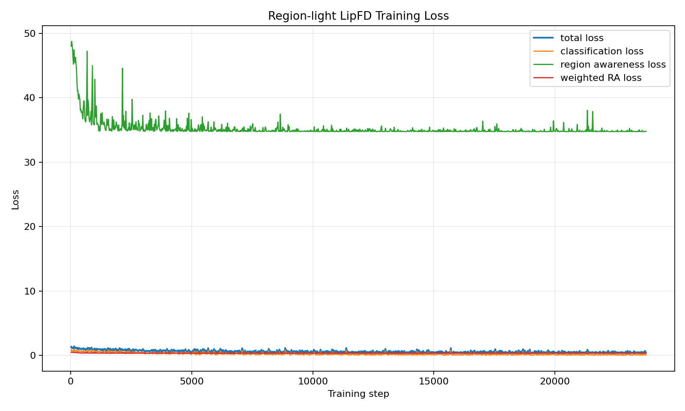

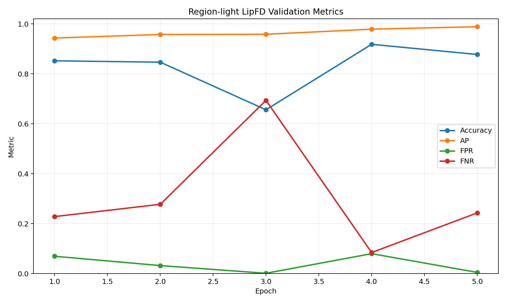

每轮验证：

| Epoch | Train Loss Mean | Acc | AP | FPR | FNR |
|---:|---:|---:|---:|---:|---:|
| 1 | 0.8509 | 0.8520 | 0.9432 | 0.0692 | 0.2282 |
| 2 | 0.6248 | 0.8464 | 0.9575 | 0.0320 | 0.2774 |
| 3 | 0.5509 | 0.6559 | 0.9582 | 0.0012 | 0.6935 |
| 4 | 0.5088 | 0.9181 | 0.9787 | 0.0797 | 0.0842 |
| 5 | 0.4840 | 0.8773 | 0.9885 | 0.0047 | 0.2430 |

参数与速度：

```text
total_params: 438.795815M
bs=1 synthetic: 44.13 ms, 22.66 FPS
bs=16 synthetic: 241.74 ms/batch, 66.19 samples/s
```

结论：

- `ra_loss_weight=0.01` 是 ViT-L/14 + ResNet18 阶段最好的训练策略。
- Best epoch 是 epoch 4，Acc 0.9181，AP 0.9787，FPR/FNR 较均衡。
- 这是后续替换 CLIP 前的中间最佳模型。

---

## 7. CLIP ViT-B 替换实验

### 7.1 修改内容

支持：

```text
ViT-B/16
ViT-B/32
```

关键改动：

- `LipFDRegionLight` 支持 `--clip_name`。
- ViT-L/14 全局特征维度是 768，ViT-B/16 和 ViT-B/32 是 512。
- Region Awareness 的 `get_weight` 和 `fc` 输入维度改为可配置。
- 加载官方 ckpt 时，只加载 shape 匹配的 `conv1` / `encoder` 权重。
- ViT-B 的 encoder 使用 `clip.load()` 自带 CLIP 预训练权重，不复用 ViT-L/14 形状不匹配权重。

### 7.2 ViT-B/16 + ResNet18 + ra_loss_weight=0.01

结果目录：

```text
lightweight/results/checkpoints/region_resnet18_clip_b16_ra0p01
```

曲线图：

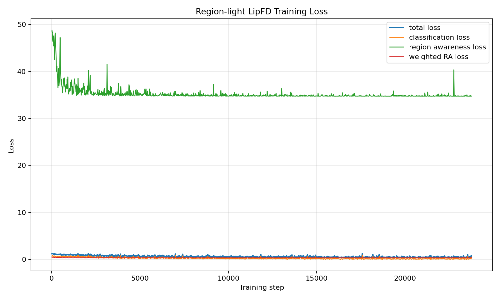

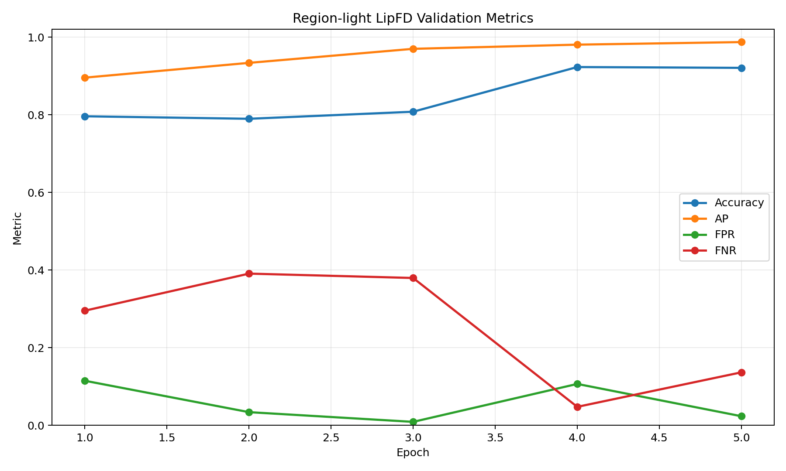

每轮验证：

| Epoch | Train Loss Mean | Acc | AP | FPR | FNR |
|---:|---:|---:|---:|---:|---:|
| 1 | 0.8923 | 0.7959 | 0.8955 | 0.1146 | 0.2952 |
| 2 | 0.6456 | 0.7895 | 0.9336 | 0.0337 | 0.3906 |
| 3 | 0.5577 | 0.8077 | 0.9697 | 0.0087 | 0.3794 |
| 4 | 0.5142 | 0.9228 | 0.9805 | 0.1065 | 0.0474 |
| 5 | 0.4865 | 0.9207 | 0.9871 | 0.0233 | 0.1363 |

参数与速度：

| Item | Value |
|---|---:|
| Total params | 160.799527M |
| Encoder params | 149.620737M |
| Backbone params | 11.178562M |
| bs=1 synthetic | 40.84 ms, 24.49 FPS |
| bs=16 synthetic | 105.07 ms/batch, 152.27 samples/s |

结论：

- ViT-B/16 参数量大幅降低，FNR 很低。
- 但 best epoch 的 FPR=0.1065，比 ViT-B/32 高。
- 保留为“低漏检候选”，不作为当前主线。

### 7.3 ViT-B/32 + ResNet18 + ra_loss_weight=0.01

结果目录：

```text
lightweight/results/checkpoints/region_resnet18_clip_b32_ra0p01
```

曲线图：

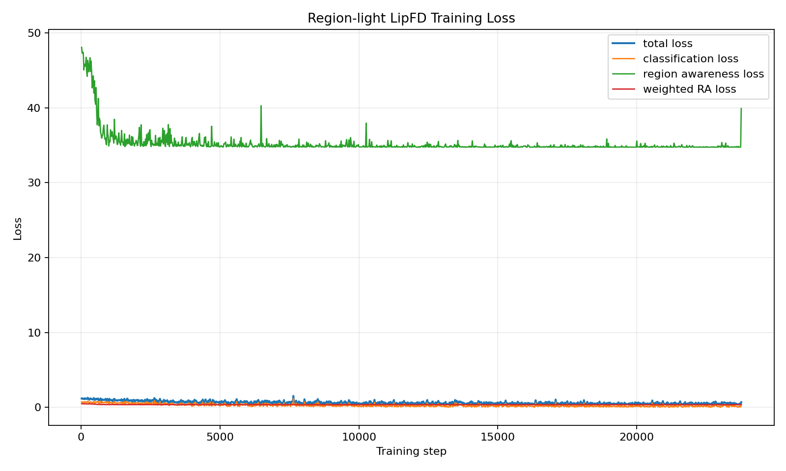

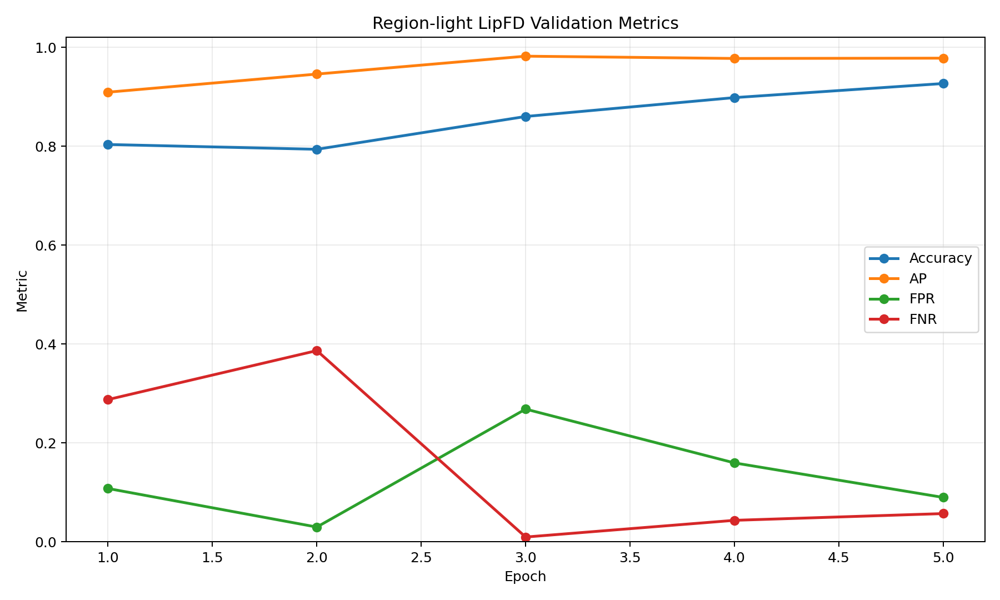

每轮验证：

| Epoch | Train Loss Mean | Acc | AP | FPR | FNR |
|---:|---:|---:|---:|---:|---:|
| 1 | 0.8852 | 0.8033 | 0.9091 | 0.1076 | 0.2875 |
| 2 | 0.6436 | 0.7936 | 0.9457 | 0.0297 | 0.3865 |
| 3 | 0.5681 | 0.8600 | 0.9819 | 0.2682 | 0.0095 |
| 4 | 0.5285 | 0.8981 | 0.9773 | 0.1594 | 0.0433 |
| 5 | 0.4972 | 0.9266 | 0.9779 | 0.0896 | 0.0569 |

参数与速度：

| Item | Value |
|---|---:|
| Total params | 162.456103M |
| Encoder params | 151.277313M |
| Backbone params | 11.178562M |
| bs=1 synthetic | 41.93 ms, 23.85 FPS |
| bs=16 synthetic | 72.26 ms/batch, 221.41 samples/s |

结论：

- ViT-B/32 在官方阈值 0.5 下 Acc 最高。
- FPR/FNR 比 ViT-B/16 更均衡。
- 作为当前轻量化主线。

---

## 8. DataLoader 与离线验证端到端测速

### 8.1 DataLoader 温和扫描

结果文件：

```text
lightweight/results/checkpoints/region_resnet18_clip_b32_ra0p01/dataloader_scan_80batches.json
lightweight/results/checkpoints/region_resnet18_clip_b32_ra0p01/dataloader_scan_80batches.csv
```

扫描设置：

```text
batch_size: 16
max_batches: 80
model: ViT-B/32 + ResNet18 ra0p01
```

结果：

| num_workers | prefetch_factor | FPS | Total ms/sample | Data wait ms/sample | Forward ms/sample |
|---:|---:|---:|---:|---:|---:|
| 4 | 2 | 17.55 | 56.96 | 49.93 | 6.90 |
| 4 | 4 | 17.69 | 56.52 | 49.89 | 6.54 |
| 8 | 2 | 31.48 | 31.76 | 25.10 | 6.47 |
| 8 | 4 | 31.60 | 31.65 | 24.92 | 6.51 |
| 12 | 2 | 41.30 | 24.21 | 17.43 | 6.50 |
| 12 | 4 | 41.96 | 23.83 | 17.05 | 6.49 |

结论：

- worker 数量影响远大于 prefetch_factor。
- 当前共享服务器上推荐 `num_workers=12, prefetch_factor=4`。
- 不建议继续盲目增大 worker，避免影响其他人使用服务器。

### 8.2 ViT-B/32 完整验证集端到端

结果文件：

```text
lightweight/results/checkpoints/region_resnet18_clip_b32_ra0p01/e2e_val_benchmark_w12p4.json
lightweight/results/checkpoints/region_resnet18_clip_b32_ra0p01/e2e_val_scores_w12p4.csv
```

配置：

```text
batch_size: 16
num_workers: 12
prefetch_factor: 4
samples: 3406
batches: 213
```

| Item | Value |
|---|---:|
| Acc | 0.9266001174 |
| AP | 0.9778793471 |
| FPR | 0.0895869692 |
| FNR | 0.0569057499 |
| Total time including metrics | 78.5763 s |
| FPS including metrics | 43.3464 samples/s |
| Total ms/sample | 23.0700 ms |
| Data wait ms/sample | 14.4834 ms |
| Transfer + forward ms/sample | 8.4337 ms |

解释：

- 离线验证吞吐已经超过 30 samples/s。
- 但这不是严格单路视频在线实时延迟，因为它使用 batch 和 DataLoader 并行预取。
- 真实视频实时系统还要包含视频解码、音频 mel 和大图构造。

---

## 9. 官方原模型 vs 当前轻量模型同口径对照

| Model | Params | Acc | AP | FPR | FNR | E2E FPS | E2E ms/sample | Forward ms/sample |
|---|---:|---:|---:|---:|---:|---:|---:|---:|
| Official ViT-L/14 + ResNet50 | 451.1304M | 0.9372 | 0.9828 | 0.0303 | 0.0960 | 34.18 | 29.26 | 26.58 |
| ViT-B/32 + ResNet18 ra0p01 | 162.4561M | 0.9266 | 0.9779 | 0.0896 | 0.0569 | 43.35 | 23.07 | 8.43 |

为什么端到端提升只有 1.27x，而前向提升有 3.15x：

```text
轻量模型前向更快后，GPU 等数据的时间占比变高。
官方原模型前向较慢，DataLoader 有更多时间在后台准备下一批数据，所以观测到的数据等待时间反而更低。
```

结论：

```text
模型计算已经明显加速；
继续追求真实系统速度时，应优先优化预处理和推理链路。
```

---

## 10. 真实视频端到端测速

新增脚本：

```text
lightweight/scripts/benchmark_video_pipeline.py
```

脚本流程：

```text
video + wav
-> OpenCV 抽帧
-> librosa 生成 mel
-> 内存复现 plt.imsave -> plt.imread -> *255
-> 拼接官方 1000x2500 大图
-> 按 data/datasets.py 逻辑做 resize / crop / normalize
-> ViT-B/32 + ResNet18 推理
-> 输出 JSON 和 scores CSV
```

注意：

- 不修改 `data/datasets.py`。
- 不改变官方输入语义。
- 不把中间大图 PNG 写盘。
- 本脚本用于真实视频链路测速，不用于替代正式训练集预处理。

### 10.1 20 视频温和测试

注意：本节是早期真实视频链路测试。当时内存 tensor 路径使用了 RGB / 0-1 / CLIP normalize，不严格等价于当前服务器 `data/datasets.py`，因此速度和分类指标只保留为探索记录。严格可信的新基线见 11.3。

结果文件：

```text
lightweight/results/checkpoints/region_resnet18_clip_b32_ra0p01/video_pipeline_20videos.json
lightweight/results/checkpoints/region_resnet18_clip_b32_ra0p01/video_pipeline_20videos_scores.csv
```

配置：

```text
video_root: ./AVLips
audio_root: ./AVLips/wav
max_videos_per_class: 10
videos: 20
windows: 200
batch_size: 16
```

速度结果：

| Item | Value |
|---|---:|
| Total time | 16.9629 s |
| Windows/s | 11.7905 |
| Videos/s | 1.1790 |
| Total ms/window | 84.8143 ms |
| Pre-model ms/window | 70.6347 ms |
| Transfer + forward ms/window | 13.9566 ms |
| Failures | 0 |

阶段耗时：

| Stage | Seconds | Meaning |
|---|---:|---|
| Video decode | 1.3805 | OpenCV 读取抽样帧并 resize |
| Audio mel | 2.5741 | librosa load + mel + 内存 PNG roundtrip |
| Compose big image | 7.8028 | mel 子段 resize + 5 帧横向拼接 + 上下拼接 |
| Tensor transform | 2.3695 | 转 tensor、整图 resize、crop、normalize |
| Transfer + forward | 2.7913 | GPU transfer + CLIP/Region forward |

分类指标：

```text
acc: 0.48
ap: 0.5155
fpr: 0.99
fnr: 0.05
```

这个分类指标不作为模型准确率结论，因为这里只取每类排序最前 10 个训练视频，样本量小且分布不代表完整验证集。本测试主要用于真实视频链路测速。

真实视频链路结论：

```text
总耗时: 84.81 ms/window
预处理: 70.63 ms/window
模型传输 + 前向: 13.96 ms/window
```

也就是说，当前真实视频系统瓶颈主要在模型前预处理，而不是模型本身。

---

## 11. 内存准实时预处理改造

### 11.1 Step 1：加入细粒度预处理 profile

修改文件：

```text
lightweight/scripts/benchmark_video_pipeline.py
```

新增参数：

```text
--profile_preprocess_detail
```

修改目的：

- 不改变输入语义。
- 不改 `data/datasets.py`。
- 不改颜色通道、像素范围、归一化方式。
- 只把真实视频链路的预处理耗时拆细，定位下一步优化目标。

测试命令：

```bash
CUDA_VISIBLE_DEVICES=3 python lightweight/scripts/benchmark_video_pipeline.py \
  --clip_name ViT-B/32 \
  --backbone resnet18 \
  --ckpt ./lightweight/results/checkpoints/region_resnet18_clip_b32_ra0p01/best.pth \
  --video_root ./AVLips \
  --audio_root ./AVLips/wav \
  --max_videos_per_class 10 \
  --batch_size 16 \
  --gpu 0 \
  --profile_preprocess_detail \
  --output ./lightweight/results/checkpoints/region_resnet18_clip_b32_ra0p01/video_pipeline_profile_20videos.json \
  --save_scores ./lightweight/results/checkpoints/region_resnet18_clip_b32_ra0p01/video_pipeline_profile_20videos_scores.csv
```

结果文件：

```text
lightweight/results/checkpoints/region_resnet18_clip_b32_ra0p01/video_pipeline_profile_20videos.json
lightweight/results/checkpoints/region_resnet18_clip_b32_ra0p01/video_pipeline_profile_20videos_scores.csv
```

总览结果：

| Item | Value |
|---|---:|
| Videos | 20 |
| Windows | 200 |
| Total time | 15.9375 s |
| Windows/s | 12.5490 |
| Videos/s | 1.2549 |
| Total ms/window | 79.6876 ms |
| Pre-model ms/window | 64.9317 ms |
| Transfer + forward ms/window | 14.5425 ms |
| Failures | 0 |

细粒度预处理耗时：

| Stage | ms/window | Interpretation |
|---|---:|---|
| big_image_concat | 36.3955 | 最大瓶颈；把 mel 和 5 帧拼成完整 1000x2500 大图 |
| audio_load | 7.1974 | librosa 读取音频 |
| full_image_resize_normalize | 3.3377 | 整张大图 resize 到 1120x1120 并归一化 |
| tensor_from_numpy | 2.7237 | numpy 大图转 torch tensor |
| frame_read | 2.5404 | OpenCV 读帧 |
| mel_png_roundtrip | 1.8933 | 内存版 plt.imsave -> plt.imread |
| crop_normalize | 1.7241 | 三组 crop normalize |
| mel_compute | 1.6091 | melspectrogram + power_to_db |
| frame_convert_resize | 1.4662 | BGR->RGBA + frame resize |
| frame_unfold | 1.2431 | 从下半部分切出 5 帧 |
| frame_concat | 1.2401 | 5 帧横向拼接 |
| crop_inner_resize | 1.0978 | 0.65x / 0.45x crop resize |
| crop0_resize | 0.8126 | 原始 5 帧 resize 到 224 |
| mel_sub_resize | 0.7649 | mel 子段 resize 到 2500x500 |

关键结论：

```text
当前最大瓶颈不是 mel，也不是模型前向，而是完整大图拼接 big_image_concat。
```

下一步最值得做的优化：

```text
不再真的构造完整 1000x2500 大图；
直接从 sub_mel 和 frame_list 生成模型需要的 img 与 crops；
这样可以减少 big_image_concat、tensor_from_numpy、frame_unfold 等重复开销。
```

风险提醒：

```text
下一步虽然可以绕开完整大图，但必须保证生成出来的 img/crops 与 data/datasets.py 读 PNG 后的结果一致。
因此要先做 equivalence check：同一个视频 window，比较“落盘 PNG 路径”和“内存直出路径”的 tensor 差异。
```

### 11.2 Step 2：官方 PNG 路径 vs 内存路径等价性检查

新增脚本：

```text
lightweight/scripts/check_video_preprocess_equivalence.py
```

检查目标：

```text
同一个视频 window：
官方路径：生成临时 PNG -> data/datasets.py -> img/crops
内存路径：不生成 PNG -> 直接生成 img/crops

比较：
shape
max_abs_diff
mean_abs_diff
model score diff
```

重要发现：

服务器当前 `data/datasets.py` 的真实逻辑是：

```text
cv2.imread 读取 BGR
像素范围保持 0-255
img 不做 CLIP Normalize
crops 也不做 CLIP Normalize
Resize 使用 torchvision.transforms.Resize
```

因此等价性检查必须严格模拟当前 `data/datasets.py`，不能使用 RGB + 0-1 + CLIP normalize 的另一套 transform。第一次用 RGB/normalize 内存路径检查时，shape 虽然一致，但 tensor 差异很大，fake 样本 score 差异达到约 0.311，说明那条路径不能作为当前训练/验证权重的等价推理路径。

修正后，内存路径严格模拟 `data/datasets.py`，结果如下。

Real 样本：

```text
video: AVLips/0_real/0.mp4
audio: AVLips/wav/0_real/0.wav
window_index: 0
output: lightweight/results/checkpoints/region_resnet18_clip_b32_ra0p01/equiv_real0_window0_datasetlike.json
```

| Item | Value |
|---|---:|
| shape_all_equal | true |
| max_abs_diff | 0.0 |
| mean_abs_diff_across_tensors | 0.0 |
| official_score | 0.6782342196 |
| memory_score | 0.6782342196 |
| score_abs_diff | 0.0 |

Fake 样本：

```text
video: AVLips/1_fake/0.mp4
audio: AVLips/wav/1_fake/0.wav
window_index: 0
output: lightweight/results/checkpoints/region_resnet18_clip_b32_ra0p01/equiv_fake0_window0_datasetlike.json
```

| Item | Value |
|---|---:|
| shape_all_equal | true |
| max_abs_diff | 0.0 |
| mean_abs_diff_across_tensors | 0.0 |
| official_score | 0.9997695088 |
| memory_score | 0.9997695088 |
| score_abs_diff | 0.0 |

结论：

```text
已经证明：只要内存路径严格模拟当前 data/datasets.py，就可以做到与官方临时 PNG 路径完全等价。
```

下一步：

```text
把 benchmark_video_pipeline.py 的内存 tensor 生成逻辑切换为 dataset-like 路径；
然后重新跑 20 视频真实链路测速；
再开始绕开完整 1000x2500 大图拼接，逐步减少 big_image_concat 开销。
```

### 11.3 Step 3：切换 `benchmark_video_pipeline.py` 到 dataset-like 路径

修改文件：

```text
lightweight/scripts/benchmark_video_pipeline.py
```

修改内容：

```text
内存 tensor 生成逻辑改为严格模拟当前 data/datasets.py：
1. RGB big image -> BGR
2. 保持 0-255 float32 像素范围
3. 使用 torchvision.transforms.Resize
4. 不做 CLIP Normalize
5. 输出 img 与 crops 的结构保持不变
```

这一步不是为了提速，而是为了把真实视频测速切换到“与当前权重严格一致”的可信路径。

运行命令：

```bash
CUDA_VISIBLE_DEVICES=3 python lightweight/scripts/benchmark_video_pipeline.py \
  --clip_name ViT-B/32 \
  --backbone resnet18 \
  --ckpt ./lightweight/results/checkpoints/region_resnet18_clip_b32_ra0p01/best.pth \
  --video_root ./AVLips \
  --audio_root ./AVLips/wav \
  --max_videos_per_class 10 \
  --batch_size 16 \
  --gpu 0 \
  --profile_preprocess_detail \
  --output ./lightweight/results/checkpoints/region_resnet18_clip_b32_ra0p01/video_pipeline_datasetlike_20videos.json \
  --save_scores ./lightweight/results/checkpoints/region_resnet18_clip_b32_ra0p01/video_pipeline_datasetlike_20videos_scores.csv
```

结果文件：

```text
lightweight/results/checkpoints/region_resnet18_clip_b32_ra0p01/video_pipeline_datasetlike_20videos.json
lightweight/results/checkpoints/region_resnet18_clip_b32_ra0p01/video_pipeline_datasetlike_20videos_scores.csv
```

总览结果：

| Item | Value |
|---|---:|
| Videos | 20 |
| Windows | 200 |
| Acc | 0.8950 |
| AP | 0.9806 |
| FPR | 0.1500 |
| FNR | 0.0600 |
| Total time | 22.6381 s |
| Windows/s | 8.8347 |
| Videos/s | 0.8835 |
| Total ms/window | 113.1906 ms |
| Pre-model ms/window | 97.8133 ms |
| Transfer + forward ms/window | 15.0510 ms |
| Failures | 0 |

细粒度耗时：

| Stage | ms/window | Interpretation |
|---|---:|---|
| big_image_concat | 37.4902 | 仍是最大瓶颈，完整大图拼接 |
| rgb_to_bgr | 27.0130 | 为严格模拟 `cv2.imread` 的 BGR，当前对整张大图做通道反转和 copy |
| audio_load | 7.0985 | librosa 读取音频 |
| crop_inner_resize | 6.2237 | 0.65x / 0.45x crop resize |
| crop0_resize | 4.4454 | 5 帧 resize 到 224 |
| frame_read | 2.6964 | OpenCV 读帧 |
| full_image_resize | 2.5530 | 整图 resize 到 1120 |
| mel_png_roundtrip | 2.2682 | 内存版 plt.imsave -> plt.imread |
| frame_convert_resize | 1.7646 | BGR->RGBA + 500x500 resize |
| tensor_from_numpy | 1.7084 | numpy -> torch |
| mel_compute | 1.6428 | melspectrogram + power_to_db |

结论：

```text
dataset-like 版本比早期非严格等价版本慢：
早期探索版: 11.79 windows/s
严格 dataset-like 版: 8.83 windows/s
```

但 dataset-like 版本才是当前可信基线，因为它与 `data/datasets.py` 等价。下一步优化应该优先解决：

```text
1. big_image_concat: 37.49 ms/window
2. rgb_to_bgr: 27.01 ms/window
```

这两个步骤合计约 64.50 ms/window，占总耗时的一半以上。后续应绕开完整 1000x2500 大图构造，并直接生成 BGR tensor，避免整张大图的通道反转和 copy。

### 11.4 Step 4：绕开完整 RGB 大图，直接生成 BGR tensor

修改文件：

```text
lightweight/scripts/benchmark_video_pipeline.py
lightweight/scripts/check_video_preprocess_equivalence.py
```

修改内容：

```text
旧路径：
sub_mel + 5 frames -> concatenate 成 1000x2500 RGB numpy
-> 整张大图 RGB->BGR copy
-> torch tensor

新路径：
sub_mel + 5 frames
-> 直接填充 data/datasets.py 需要的 BGR 0-255 torch tensor
-> torchvision Resize 得到 img/crops
```

等价性检查：

```text
real output: lightweight/results/checkpoints/region_resnet18_clip_b32_ra0p01/equiv_real0_window0_direct_bgr.json
fake output: lightweight/results/checkpoints/region_resnet18_clip_b32_ra0p01/equiv_fake0_window0_direct_bgr.json
```

结果：

| Sample | shape_all_equal | max_abs_diff | mean_abs_diff | score_abs_diff |
|---|---:|---:|---:|---:|
| real `AVLips/0_real/0.mp4` | true | 0.0 | 0.0 | 0.0 |
| fake `AVLips/1_fake/0.mp4` | true | 0.0 | 0.0 | 0.0 |

重要修正：

```text
服务器当前 data/datasets.py 的 crops[0] 切片是：
img[:, 500:, i:i+500] for i in range(5)

不是：
img[:, 500:, i*500:(i+1)*500]
```

因此 benchmark 脚本必须严格复现这个切片方式，否则 img 可能一致，但 crops 和 score 会不一致。

20 视频测速命令：

```bash
CUDA_VISIBLE_DEVICES=3 python lightweight/scripts/benchmark_video_pipeline.py \
  --clip_name ViT-B/32 \
  --backbone resnet18 \
  --ckpt ./lightweight/results/checkpoints/region_resnet18_clip_b32_ra0p01/best.pth \
  --video_root ./AVLips \
  --audio_root ./AVLips/wav \
  --max_videos_per_class 10 \
  --batch_size 16 \
  --gpu 0 \
  --profile_preprocess_detail \
  --output ./lightweight/results/checkpoints/region_resnet18_clip_b32_ra0p01/video_pipeline_direct_bgr_20videos.json \
  --save_scores ./lightweight/results/checkpoints/region_resnet18_clip_b32_ra0p01/video_pipeline_direct_bgr_20videos_scores.csv
```

结果文件：

```text
lightweight/results/checkpoints/region_resnet18_clip_b32_ra0p01/video_pipeline_direct_bgr_20videos.json
lightweight/results/checkpoints/region_resnet18_clip_b32_ra0p01/video_pipeline_direct_bgr_20videos_scores.csv
```

总览结果：

| Item | Value |
|---|---:|
| Videos | 20 |
| Windows | 200 |
| Acc | 0.9000 |
| AP | 0.9819 |
| FPR | 0.1300 |
| FNR | 0.0700 |
| Total time | 17.4856 s |
| Windows/s | 11.4380 |
| Videos/s | 1.1438 |
| Total ms/window | 87.4282 ms |
| Pre-model ms/window | 72.0412 ms |
| Transfer + forward ms/window | 15.1551 ms |
| Failures | 0 |

细粒度耗时：

| Stage | ms/window | Interpretation |
|---|---:|---|
| direct_bgr_tensor_build | 45.9235 | 直接填充 BGR 0-255 torch tensor，当前新瓶颈 |
| audio_load | 6.9494 | librosa 读取音频 |
| crop_inner_resize | 4.4353 | 0.65x / 0.45x crop resize |
| frame_read | 2.7446 | OpenCV 读帧 |
| crop0_resize | 2.5412 | crop resize 到 224 |
| mel_png_roundtrip | 2.3053 | 内存版 plt.imsave -> plt.imread |
| full_image_resize | 1.8964 | 整图 resize 到 1120 |
| mel_compute | 1.6873 | melspectrogram + power_to_db |
| frame_convert_resize | 1.5781 | BGR->RGBA + 500x500 resize |
| mel_sub_resize | 0.7762 | mel 子段 resize |

与上一步对比：

| Version | Windows/s | Total ms/window | Pre-model ms/window | Notes |
|---|---:|---:|---:|---|
| dataset-like big image | 8.8347 | 113.1906 | 97.8133 | 严格等价，但仍构造 RGB 大图再 BGR copy |
| direct BGR tensor | 11.4380 | 87.4282 | 72.0412 | 严格等价，绕开完整 RGB 大图与整图 BGR copy |

结论：

```text
直接 BGR tensor 路径在严格等价前提下，把真实视频链路速度从 8.83 windows/s 提升到 11.44 windows/s。
相对提升约 29.5%。
```

下一步瓶颈：

```text
direct_bgr_tensor_build: 45.92 ms/window
```

这说明虽然已经绕开了完整 RGB 大图和 rgb_to_bgr copy，但当前逐 window 构造完整 3x1000x2500 tensor 仍然很贵。
下一步应该继续减少重复构造：

```text
1. 每个视频只构造一次全局底部 frame tensor，多个 window 复用。
2. 对 crops 直接从 frame tensor 生成，不再依赖完整 1000x2500 tensor。
3. 对 CLIP 全局 img 再单独构造需要的上下拼接 tensor。
4. 更进一步可以把 full image resize 和 crop resize 放到 GPU batch 化，但要先做等价性检查。
```

### 11.5 Step 5：复用每个视频的 frame tensor，并直接生成 crops

修改文件：

```text
lightweight/scripts/benchmark_video_pipeline.py
```

修改内容：

```text
1. 每个视频的抽样帧只转换一次 BGR torch tensor。
2. 每个 window 复用这些 cached frame tensors。
3. crops 不再从完整 3x1000x2500 tensor 切，而是从窄 frame source 直接生成。
4. 保留 full image tensor 供 CLIP 全局分支使用。
```

关键等价性细节：

```text
当前 data/datasets.py 的 crop 逻辑是 img[:, 500:, i:i+500] for i in range(5)。
因此 i=1..4 的 crop 会跨到第二帧的前几列。
直接 crops 路径必须构造一个窄 source：
first_frame + second_frame 前 4 列
然后再切 i:i+500。
```

等价性检查：

```text
real output: lightweight/results/checkpoints/region_resnet18_clip_b32_ra0p01/equiv_real0_window0_direct_bgr.json
fake output: lightweight/results/checkpoints/region_resnet18_clip_b32_ra0p01/equiv_fake0_window0_direct_bgr.json
```

结果：

| Sample | shape_all_equal | max_abs_diff | mean_abs_diff | score_abs_diff |
|---|---:|---:|---:|---:|
| real `AVLips/0_real/0.mp4` | true | 0.0 | 0.0 | 0.0 |
| fake `AVLips/1_fake/0.mp4` | true | 0.0 | 0.0 | 0.0 |

20 视频测速结果文件：

```text
lightweight/results/checkpoints/region_resnet18_clip_b32_ra0p01/video_pipeline_cached_frames_20videos.json
lightweight/results/checkpoints/region_resnet18_clip_b32_ra0p01/video_pipeline_cached_frames_20videos_scores.csv
```

总览结果：

| Item | Value |
|---|---:|
| Videos | 20 |
| Windows | 200 |
| Acc | 0.9000 |
| AP | 0.9819 |
| FPR | 0.1300 |
| FNR | 0.0700 |
| Total time | 15.3158 s |
| Windows/s | 13.0584 |
| Videos/s | 1.3058 |
| Total ms/window | 76.5791 ms |
| Pre-model ms/window | 62.1773 ms |
| Transfer + forward ms/window | 14.2500 ms |
| Failures | 0 |

细粒度耗时：

| Stage | ms/window | Interpretation |
|---|---:|---|
| frame_tensor_cache | 16.2314 | 每个视频一次性缓存帧 tensor，均摊到 window |
| top_mel_tensor | 14.7168 | 每个 window 的 mel top 转 BGR tensor |
| audio_load | 7.0962 | librosa 读取音频 |
| global_tensor_build | 4.5522 | 拼 CLIP 全局分支需要的 full tensor |
| crop_inner_resize | 4.2506 | 0.65x / 0.45x crop resize |
| crop0_resize | 3.0547 | 直接 crops resize 到 224 |
| frame_read | 2.8109 | OpenCV 读帧 |
| mel_png_roundtrip | 2.3257 | 内存版 plt.imsave -> plt.imread |
| full_image_resize | 1.8463 | 整图 resize 到 1120 |
| mel_compute | 1.7416 | melspectrogram + power_to_db |

与前几版对比：

| Version | Windows/s | Total ms/window | Pre-model ms/window | Equivalent |
|---|---:|---:|---:|---|
| non-equivalent early path | 11.7905 | 84.8143 | 70.6347 | No |
| dataset-like big image | 8.8347 | 113.1906 | 97.8133 | Yes |
| direct BGR tensor | 11.4380 | 87.4282 | 72.0412 | Yes |
| cached frame tensor + direct crops | 13.0584 | 76.5791 | 62.1773 | Yes |

结论：

```text
复用 frame tensor + 直接 crops 后，严格等价路径从 8.83 windows/s 提升到 13.06 windows/s。
相比 dataset-like big image 基线提升约 47.8%。
相比 direct BGR tensor 版本提升约 14.2%。
```

下一步瓶颈：

```text
frame_tensor_cache: 16.23 ms/window
top_mel_tensor: 14.72 ms/window
```

这两个步骤本质上仍是 CPU tensor 构造/拷贝成本。下一步可以考虑：

```text
1. 用 numpy 预先组织 top+bottom，再一次性 torch.from_numpy，比较是否比多次 torch cat 更快。
2. 将多个 window 的 top mel 一次性 batch 化转换。
3. 把 resize/crop 尝试移到 GPU batch 处理，但必须重新做 equivalence check。
4. 在线系统里复用滑动窗口帧，避免每个判断周期重复转换相邻帧。
```

---

## 12. 运行命令汇总

### 12.1 当前最佳模型验证

```bash
cd /root/lx/LipFD
source ~/anaconda3/etc/profile.d/conda.sh
conda activate lips

CUDA_VISIBLE_DEVICES=3 python lightweight/scripts/validate_region_light.py \
  --clip_name ViT-B/32 \
  --backbone resnet18 \
  --ckpt ./lightweight/results/checkpoints/region_resnet18_clip_b32_ra0p01/best.pth \
  --real_list_path ./datasets/val/0_real \
  --fake_list_path ./datasets/val/1_fake \
  --batch_size 16 \
  --num_workers 12 \
  --prefetch_factor 4 \
  --gpu 0 \
  --save_scores ./lightweight/results/checkpoints/region_resnet18_clip_b32_ra0p01/val_scores_best_fastio.csv
```

### 12.2 当前最佳模型离线验证端到端测速

```bash
CUDA_VISIBLE_DEVICES=3 python lightweight/scripts/benchmark_region_light_e2e.py \
  --clip_name ViT-B/32 \
  --backbone resnet18 \
  --ckpt ./lightweight/results/checkpoints/region_resnet18_clip_b32_ra0p01/best.pth \
  --real_list_path ./datasets/val/0_real \
  --fake_list_path ./datasets/val/1_fake \
  --batch_size 16 \
  --num_workers 12 \
  --prefetch_factor 4 \
  --gpu 0 \
  --max_batches -1 \
  --output ./lightweight/results/checkpoints/region_resnet18_clip_b32_ra0p01/e2e_val_benchmark_w12p4.json \
  --save_scores ./lightweight/results/checkpoints/region_resnet18_clip_b32_ra0p01/e2e_val_scores_w12p4.csv
```

### 12.3 真实视频链路测速（严格 dataset-like）

```bash
CUDA_VISIBLE_DEVICES=3 python lightweight/scripts/benchmark_video_pipeline.py \
  --clip_name ViT-B/32 \
  --backbone resnet18 \
  --ckpt ./lightweight/results/checkpoints/region_resnet18_clip_b32_ra0p01/best.pth \
  --video_root ./AVLips \
  --audio_root ./AVLips/wav \
  --max_videos_per_class 10 \
  --batch_size 16 \
  --gpu 0 \
  --profile_preprocess_detail \
  --output ./lightweight/results/checkpoints/region_resnet18_clip_b32_ra0p01/video_pipeline_cached_frames_20videos.json \
  --save_scores ./lightweight/results/checkpoints/region_resnet18_clip_b32_ra0p01/video_pipeline_cached_frames_20videos_scores.csv
```

---

## 13. 下一步路线

下一步不要先换模型，先优化真实视频预处理链路。

推荐顺序：

1. 已完成：在 `benchmark_video_pipeline.py` 中加入更细粒度 profile。

```text
audio_load_ms
mel_compute_ms
mel_png_roundtrip_ms
frame_resize_ms
mel_sub_resize_ms
big_image_concat_ms
tensor_convert_ms
full_image_resize_ms
crop_resize_ms
normalize_ms
```

2. 已定位当前最大瓶颈：

```text
big_image_concat: 36.40 ms/window
```

3. 已完成：做 equivalence check，dataset-like 内存路径与官方 PNG 路径完全一致。

```text
同一个视频 window：
官方落盘 PNG -> data/datasets.py -> img/crops
内存直出 -> img/crops
max_abs_diff = 0.0
mean_abs_diff = 0.0
score_abs_diff = 0.0
```

4. 已完成：把 benchmark_video_pipeline.py 切换为 dataset-like 路径，并重新跑 20 视频测速。

```text
dataset-like baseline: 8.83 windows/s
pre_model_ms/window: 97.81 ms
transfer_forward_ms/window: 15.05 ms
```

5. 已完成：绕开完整 RGB 大图，直接生成 BGR tensor。

```text
direct BGR tensor: 11.44 windows/s
pre_model_ms/window: 72.04 ms
transfer_forward_ms/window: 15.16 ms
max_abs_diff = 0.0
score_abs_diff = 0.0
```

6. 已完成：复用每个视频的 frame tensor，并直接从窄 frame source 生成 crops。

```text
cached frame tensor + direct crops: 13.06 windows/s
pre_model_ms/window: 62.18 ms
transfer_forward_ms/window: 14.25 ms
max_abs_diff = 0.0
score_abs_diff = 0.0
```

7. 后续优化方向：

```text
减少 CPU tensor 构造和拷贝
尝试 batch 化 top mel tensor 构造
评估 GPU batch resize/crop 是否能保持等价并提速
在线检测时用滑动窗口复用相邻帧和 mel
最后再考虑 FP16 / TensorRT
```

8. 阶段目标：

```text
真实视频链路从 11.79 windows/s 提升到 20+ windows/s；
每秒输出 5-10 次 fake probability；
形成准实时 LipFD-Light 视频检测 demo。
```

当前项目阶段判断：

```text
模型轻量化已经完成第一轮有效版本；
系统实时性瓶颈已经定位到预处理；
下一阶段是从“论文离线流程”过渡到“内存准实时推理流程”。
```

### 11.6 Step 6：batch 化 top mel / window tensor，并评估 GPU batch resize/crop

修改文件：

```text
lightweight/scripts/benchmark_video_pipeline.py
lightweight/scripts/check_video_preprocess_equivalence.py
```

修改内容：

```text
1. cache_frame_tensors 改为先 np.stack，再一次 torch.from_numpy，减少逐帧 tensor 构造开销。
2. 新增 build_top_mel_tensor_batch，一次构造同一视频多个 window 的 top mel tensor。
3. 新增 build_window_tensors_batched，批量构造多个 window 的 full img、crop0、inner crop。
4. 新增 --preprocess_device cpu/gpu，用同一套脚本对比 CPU batch 路径和 GPU batch resize/crop 路径。
```

重要约束：

```text
本轮仍然不修改 data/datasets.py。
不改变 BGR 通道、0-255 像素范围、不引入额外 normalize。
继续严格复现当前 data/datasets.py 的 crop 语义：
img[:, 500:, i:i+500] for i in range(5)
```

等价性检查命令输出文件：

```text
lightweight/results/checkpoints/region_resnet18_clip_b32_ra0p01/equiv_real0_window0_batch_cpu.json
lightweight/results/checkpoints/region_resnet18_clip_b32_ra0p01/equiv_real0_window0_batch_gpu.json
lightweight/results/checkpoints/region_resnet18_clip_b32_ra0p01/equiv_fake0_window0_batch_cpu.json
lightweight/results/checkpoints/region_resnet18_clip_b32_ra0p01/equiv_fake0_window0_batch_gpu.json
```

等价性检查结果：

| Sample | preprocess_device | shape_all_equal | max_abs_diff | mean_abs_diff | official_score | memory_score | score_abs_diff |
|---|---|---:|---:|---:|---:|---:|---:|
| real `AVLips/0_real/0.mp4` | cpu | true | 0.0 | 0.0 | 0.6782342196 | 0.6782342196 | 0.0 |
| real `AVLips/0_real/0.mp4` | gpu | true | 0.0 | 0.0 | 0.6782342196 | 0.6782342196 | 0.0 |
| fake `AVLips/1_fake/0.mp4` | cpu | true | 0.0 | 0.0 | 0.9997695088 | 0.9997695088 | 0.0 |
| fake `AVLips/1_fake/0.mp4` | gpu | true | 0.0 | 0.0 | 0.9997695088 | 0.9997695088 | 0.0 |

结论：

```text
CPU batch 路径和 GPU batch resize/crop 路径都与官方 PNG -> data/datasets.py 路径完全等价。
GPU 路径没有出现 resize/crop 数值偏差，本轮可以用于测速对比。
```

20 视频测速结果文件：

```text
lightweight/results/checkpoints/region_resnet18_clip_b32_ra0p01/video_pipeline_batch_cpu_20videos.json
lightweight/results/checkpoints/region_resnet18_clip_b32_ra0p01/video_pipeline_batch_cpu_20videos_scores.csv
lightweight/results/checkpoints/region_resnet18_clip_b32_ra0p01/video_pipeline_batch_gpu_20videos.json
lightweight/results/checkpoints/region_resnet18_clip_b32_ra0p01/video_pipeline_batch_gpu_20videos_scores.csv
```

统一配置：

```text
videos: 20
windows: 200
batch_size: 16
model: ViT-B/32 + ResNet18 + ra_loss_weight=0.01
checkpoint: lightweight/results/checkpoints/region_resnet18_clip_b32_ra0p01/best.pth
CUDA_VISIBLE_DEVICES=3
```

总体结果：

| Version | Acc | AP | FPR | FNR | Total time | Windows/s | Videos/s | Total ms/window | Pre-model ms/window | Transfer + forward ms/window | Failures |
|---|---:|---:|---:|---:|---:|---:|---:|---:|---:|---:|---:|
| cached frame tensor + direct crops | 0.9000 | 0.9819 | 0.1300 | 0.0700 | 15.3158 s | 13.0584 | 1.3058 | 76.5791 | 62.1773 | 14.2500 | 0 |
| batch CPU preprocess | 0.9000 | 0.9819 | 0.1300 | 0.0700 | 21.1350 s | 9.4630 | 0.9463 | 105.6748 | 79.6321 | 21.4704 | 0 |
| batch GPU resize/crop | 0.9000 | 0.9819 | 0.1300 | 0.0700 | 13.3646 s | 14.9649 | 1.4965 | 66.8230 | 57.4127 | 9.3481 | 0 |

batch CPU preprocess 细粒度耗时：

| Stage | ms/window |
|---|---:|
| frame_tensor_cache | 16.7928 |
| top_mel_tensor_batch | 15.7682 |
| audio_load | 15.4828 |
| global_tensor_build | 7.1803 |
| full_image_resize | 4.6008 |
| video_open_meta | 3.0152 |
| frame_read | 2.9370 |
| mel_png_roundtrip | 2.2557 |
| frame_convert_resize | 1.8888 |
| mel_compute | 1.8051 |
| crop_source_build | 0.9562 |
| mel_sub_resize | 0.8994 |
| crop_inner_resize | 0.8011 |
| crop0_resize | 0.5278 |
| crop_pack | 0.0479 |

batch GPU resize/crop 细粒度耗时：

| Stage | ms/window |
|---|---:|
| frame_tensor_cache | 19.9912 |
| top_mel_tensor_batch | 19.3793 |
| audio_load | 8.2558 |
| frame_read | 2.7086 |
| mel_png_roundtrip | 1.9208 |
| mel_compute | 1.7127 |
| frame_convert_resize | 1.5707 |
| video_open_meta | 0.5214 |
| mel_sub_resize | 0.5049 |
| global_tensor_build | 0.0741 |
| crop_inner_resize | 0.0554 |
| crop_pack | 0.0455 |
| crop_source_build | 0.0344 |
| crop0_resize | 0.0325 |
| full_image_resize | 0.0252 |

对比结论：

```text
1. CPU batch preprocess 这次反而比 cached frame tensor + direct crops 慢：
   13.0584 -> 9.4630 windows/s，主要是 top_mel_tensor_batch、audio_load、global_tensor_build 和 transfer_forward 变慢。

2. GPU batch resize/crop 是本轮最快且严格等价的路径：
   13.0584 -> 14.9649 windows/s，相比上一轮 cached frame tensor + direct crops 提升约 14.6%。
   相比严格 dataset-like baseline 8.8347 windows/s 提升约 69.4%。

3. GPU 路径显著降低图像 resize/crop 和 global tensor build 的显式耗时：
   global_tensor_build 约 4.5522 -> 0.0741 ms/window；
   full_image_resize 约 1.8463 -> 0.0252 ms/window；
   crop0_resize 约 3.0547 -> 0.0325 ms/window；
   crop_inner_resize 约 4.2506 -> 0.0554 ms/window。

4. 新瓶颈转移到 CPU 侧数据准备：
   frame_tensor_cache 约 19.99 ms/window；
   top_mel_tensor_batch 约 19.38 ms/window；
   audio_load 约 8.26 ms/window。
```

阶段判断：

```text
当前真实视频准实时链路的可信最快结果是 GPU batch resize/crop：
14.9649 windows/s，66.8230 ms/window。

下一步不应继续改 data/datasets.py，也不应改变输入语义。
更值得做的是：
1. 检查 top_mel_tensor_batch 为什么没有比逐 window top_mel_tensor 更快；
2. 继续减少 frame_tensor_cache / top_mel_tensor_batch 的 CPU 拷贝；
3. 做滑动窗口缓存，复用相邻 window 的 frame tensor 和 mel tensor；
4. 在此之后再评估 FP16 或 TensorRT。
```

### 11.7 Web demo 短视频上传失败修复：动态窗口数

触发问题：

```text
用户上传视频：WIN_20260531_17_15_52_Pro.mp4
后端临时路径：
/root/lx/LipFD/web/backend/runtime/detect_jobs/ea60870944d44abbb9f26e48b0197e4c/input.mp4

报错：
LipFD pipeline failure:
RuntimeError('selected 32 frames, expected 50: .../input.mp4')
```

原因分析：

```text
benchmark_video_pipeline.py 原本面向 AVLips 离线 benchmark，固定 N_EXTRACT=10。
每个 window 需要 WINDOW_LEN=5 帧，因此固定期望 50 帧。

用户上传视频实际可读帧数约 33 帧，fps=18.75。
固定抽 10 个 window 时，window 起点过密，5 帧窗口发生重叠；
脚本内部 frame_list 只缓存唯一帧，但后续仍按 10*5=50 帧检查，因此失败。
```

修复内容：

```text
1. lightweight/scripts/benchmark_video_pipeline.py 新增 --num_windows 参数，默认仍为 10。
   这保证原有 20 视频 benchmark 和历史实验默认行为不变。

2. web/backend/services/detector.py 在调用真实 pipeline 前读取视频 frame_count。
   web 上传场景使用：
   num_windows = min(10, frame_count // 5)

3. 如果 frame_count < 5，直接返回“视频太短”的 400 错误。
```

验证 1：直接跑 pipeline

```text
video: /root/lx/LipFD/web/backend/runtime/detect_jobs/ea60870944d44abbb9f26e48b0197e4c/input.mp4
audio: /root/lx/LipFD/web/backend/runtime/detect_jobs/ea60870944d44abbb9f26e48b0197e4c/audio.wav
frame_count: 33
fps: 18.75
num_windows: 6
preprocess_device: gpu
```

结果：

| Item | Value |
|---|---:|
| status | success |
| windows | 6 |
| total_seconds | 2.0634 |
| windows_per_second | 2.9078 |
| total_ms_per_window | 343.9004 |
| pre_model_ms_per_window | 293.0720 |
| transfer_forward_ms_per_window | 50.4203 |
| failures | 0 |

验证 2：FastAPI `/api/detect` 只上传该短视频

```text
status: 200
label: fake
fakeProbability: 0.9711
windows: 6
fileSizeMb: 1.16
preprocessDevice: gpu
clip: ViT-B/32
backbone: resnet18
```

结论：

```text
Web demo 现在可以处理短视频上传，不再硬性要求 10 个 5 帧 window。
该修改不改变 data/datasets.py，不改变颜色通道、像素范围、归一化方式或模型输入语义；
只是在 web 上传场景中根据视频长度调整 window 数。

当前服务已按用户要求暂停运行，未保持前后端服务常驻。
```

### 11.8 Web demo v1：常驻模型、上传兼容性和前端系统化展示

目标：

```text
把 /api/detect 从“每次请求启动子进程并重新加载模型”
改成“FastAPI 进程启动时加载一次 ViT-B/32 + ResNet18，后续请求复用模型”。

同时补齐 web 上传场景兼容性处理和前端展示：
无音频视频、过短视频、竖屏视频、低 fps 视频、长视频采样提示；
窗口时间段、高风险片段、耗时拆分、中文错误提示、真实/Mock 模式区分。
```

后端改动：

```text
web/backend/services/detector.py
```

关键实现：

```text
1. 新增 ResidentLipFDDetector。
   - FastAPI startup 时 warm_up_detector() 加载模型。
   - 复用 lightweight/scripts/benchmark_video_pipeline.py 中已等价验证过的 run_pipeline。
   - 使用 threading.Lock 保护单 GPU 推理，避免并发请求互相抢同一模型实例。

2. /api/health 和 /api/detector/status 返回 detector 状态。

3. 上传兼容性：
   - 无音频视频：ffmpeg 抽音频失败时返回 400 中文错误。
   - 过短视频：frame_count < 5 时返回 400 中文错误。
   - 短视频：num_windows = min(10, frame_count // 5)，不再强制 10 个 window。
   - 竖屏视频：继续按 LipFD 输入语义 resize，但通过 warnings 提示。
   - 低 fps 视频：继续检测，但通过 warnings 提示。
   - 长视频：demo 当前最多抽 10 个 window 快速检测，并通过 warnings 提示。

4. 时间轴：
   - timeline 现在包含 startTime / endTime；
   - 前端可显示每个风险窗口的时间段。
```

前端改动：

```text
web/frontend/src/App.vue
web/frontend/src/styles/main.css
web/frontend/src/api/types.ts
```

展示能力：

```text
1. 真实模型 / Mock pipeline 分段切换。
2. 视频元数据：fps、frame count、duration、window 数。
3. Verdict + fake probability ring。
4. 高风险片段列表：显示窗口时间段、window index、score。
5. 耗时拆分：total、pre-model、transfer+forward、video decode、audio mel。
6. 兼容性 warnings 展示。
7. 中文错误提示。
8. 视觉重做为“冷静的取证控制台”风格。
```

构建与语法检查：

```text
本地 Python py_compile：通过
远端 Python py_compile：通过
远端 npm run build：通过，dist 更新时间 2026-06-03 02:12
```

常驻模型 smoke test：

```text
TestClient 启动 FastAPI 后，/api/health 返回：
loaded: true
device: cuda:0
clip: ViT-B/32
backbone: resnet18
checkpoint: /root/lx/LipFD/lightweight/results/checkpoints/region_resnet18_clip_b32_ra0p01/best.pth
```

短视频真实检测样本：

```text
video: WIN_20260531_17_15_52_Pro.mp4
frameCount: 33
fps: 18.75
resolution: 1280x720
durationSec: 1.76
sampledWindows: 6
```

连续两次同进程请求结果：

| Run | Status | Label | Windows | Total seconds | Total ms/window | Windows/s | Pre-model ms/window | Transfer+forward ms/window |
|---:|---:|---|---:|---:|---:|---:|---:|---:|
| 1 | 200 | fake | 6 | 2.1315 | 355.24 | 2.81 | 305.67 | 48.93 |
| 2 | 200 | fake | 6 | 0.4356 | 72.59 | 13.78 | 64.99 | 7.42 |

解释：

```text
第 1 次请求仍包含若干库和 CUDA 首次执行 warm-up 开销；
第 2 次请求体现常驻模型复用后的交互表现：
72.59 ms/window，13.78 windows/s。

相比之前子进程 smoke test 中单次请求约 328.34 ms/window，
常驻模型复用后的第 2 次请求延迟显著下降。
```

兼容性 smoke test：

| Case | Status | Response |
|---|---:|---|
| too_short.mp4，3 readable frames | 400 | 视频过短，至少需要 5 帧；当前可读帧数为 3。 |
| no_audio.mp4，无音频轨 | 400 | 未能从视频中提取音频轨。请确认视频包含音频，或上传对应的 WAV 文件。 |

当前结论：

```text
Web demo 已从“脚本子进程推理”升级为“FastAPI 常驻模型推理”。
上传短视频、无音频、过短视频的行为已经可控；
竖屏、低 fps、长视频通过 warnings 进入前端展示。

下一步系统优化重点：
1. 启动时做一次真实 dummy/warm-up 推理，降低首次用户请求延迟；
2. 将音频 mel / frame tensor 做请求内缓存和滑动窗口复用；
3. 支持长视频分段队列和进度回传；
4. 再评估 FP16 / TensorRT。
```

### 11.9 Web frontend premium minimalist redesign

目标：

```text
用户反馈上一版前端观感过重、过乱。
本轮按“sleek, premium, minimalist, Swiss spa-like professional SaaS”方向重做。
要求：
- 使用 icons，不使用 emoji；
- 控制 padding 和组件间距；
- 减少不必要颜色；
- 桌面和移动端都保持优雅响应式；
- 保留真实模型 / Mock、窗口时间段、高风险片段、耗时拆分等系统功能。
```

改动文件：

```text
web/frontend/src/App.vue
web/frontend/src/styles/main.css
```

设计改动：

```text
1. 将标题和交互文案收敛为更克制的英文专业界面：
   “LipFD-Light / Forgery analysis, distilled.”

2. 色彩改为低饱和米白、鼠尾草灰、深墨绿和少量风险棕红；
   删除高对比工业感背景和过多装饰。

3. 重新调整桌面布局：
   左侧输入，中间视频预览，右侧评估结果；
   下方为 timeline、高风险片段、runtime、compatibility notes。

4. 控件统一使用 lucide icons：
   UploadCloud、AudioWaveform、Play、ShieldCheck、Clock3、BarChart3、Cpu 等。

5. 保留功能但降低视觉噪声：
   probability ring、风险片段、耗时拆分、warnings 仍展示，但以更轻的面板和更均匀的间距呈现。
```

验证：

```text
远端 npm run build：通过。
构建产物：
dist/assets/index-C_nLwYoI.css
dist/assets/index-Cvf75--8.js
dist 更新时间：2026-06-03 02:39
```

### 11.10 Web frontend layout bugfix

用户反馈：

```text
首页出现巨大空白；
lucide icons 被撑得非常大；
下方明明有内容但被首屏空白挤到很下面。
```

原因：

```text
1. CSS 写了全局 svg { width: 100%; height: auto; }。
   这会覆盖 lucide icons 的 size 属性，导致 Input / Upload / Assessment 等图标被撑满容器。

2. .workspace 使用 align-items: stretch。
   中间 Preview panel 被左侧较高表单强行拉伸，视频下方产生大块空白。

3. .chart-panel 使用 grid-row: span 3。
   下方 timeline 卡片被强制跨三行，左侧区域出现大块空白。
```

修复：

```text
1. 将全局 svg 规则改为 .score-chart svg，只影响分数曲线。
2. .workspace 和 .lower-grid 改为 align-items: start。
3. media / verdict panel 改为按内容自然高度。
4. 移除 .chart-panel 的 grid-row: span 3，让下方内容自然流动。
```

验证：

```text
远端 npm run build：通过。
构建产物：
dist/assets/index-CtDKhiGR.css
dist/assets/index-DwAIDjj4.js
dist 更新时间：2026-06-03 02:51
```

### 11.11 Web frontend empty-state layout and Chinese copy

用户反馈：

```text
页面仍有空白区域；
未检测时下方区域显示大块空图表 / 空卡片；
界面文字和错误信息希望有中文。
```

修复：

```text
1. App.vue 文案改为中文为主：
   视频真伪分析、输入、选择视频、检测流程、真实模型、开始分析、
   评估、伪造概率、高风险片段、处理拆分、上传提示等。

2. 未检测前不再渲染大块空 timeline / runtime / compatibility 卡片；
   改为三张紧凑引导卡片：
   上传视频、常驻模型分析、查看风险片段。

3. 检测完成后再展开：
   时间轴、高风险片段、耗时拆分、兼容性提示。

4. 进一步收紧首屏排版：
   标题高度降低，主三栏宽度从 320/1fr/320 调整为 300/1fr/300，
   上传卡片和 verdict ring 高度收敛，减少首屏空洞。
```

验证：

```text
远端 npm run build：通过。
构建产物：
dist/assets/index-CUZ_fnYP.css
dist/assets/index-lsfBg8mp.js
dist 更新时间：2026-06-03 03:00
```

### 11.12 Web frontend drag-and-drop upload

目标：

```text
用户希望文件上传区支持直接拖入文件，而不是只能点击选择。
```

改动：

```text
web/frontend/src/App.vue
web/frontend/src/styles/main.css
```

功能：

```text
1. 视频上传卡片支持 dragenter / dragover / dragleave / drop。
2. 音频兜底卡片支持拖入 WAV / 常见音频文件。
3. 拖入时卡片出现低调高亮状态，保持 premium minimalist 风格。
4. 文件类型校验：
   - 视频区接受 video/* 或 mp4/mov/avi/webm/mkv；
   - 音频区接受 audio/* 或 wav/mp3/m4a/aac/flac；
   - 类型不匹配时返回中文提示。
```

验证：

```text
远端 npm run build：通过。
构建产物：
dist/assets/index-DR4JguW0.js
dist/assets/index-ihSAqNqZ.css
dist 更新时间：2026-06-03 03:10
```

### 11.13 Backend startup warm-up optimization

目标：

```text
常驻模型虽然避免了每次请求重新加载权重，但第一次真实请求仍会触发 CUDA / CLIP / torchvision resize 等首次执行开销。
本轮将 warm-up 前移到 FastAPI startup 阶段：
1. 加载 ViT-B/32 + ResNet18 checkpoint；
2. 使用 AVLips/0_real/0.mp4 + AVLips/wav/0_real/0.wav 跑 1 个 window；
3. /api/health 返回 loaded / warmedUp / warmupTiming，方便观察状态。
```

改动文件：

```text
web/backend/services/detector.py
```

实现：

```text
ResidentLipFDDetector 新增：
- _warmed_up
- _warmup_error
- _warmup_timing
- warm_up()

FastAPI startup 仍调用 warm_up_detector()，但现在不只是加载模型，还会执行一次小样本真实推理。
如果样本缺失，服务仍可启动，只在 status 中记录 warmupError。
```

warm-up smoke test：

```text
/api/health detector:
loaded: true
warmedUp: true
warmupError: None
device: cuda:0
clip: ViT-B/32
backbone: resnet18
```

一次 warm-up 测试结果：

| Item | Value |
|---|---:|
| warmup windows | 1 |
| warmup seconds | 8.4597 |
| warmup total ms/window | 8459.4494 |
| warmup pre-model ms/window | 5082.6181 |
| warmup transfer+forward ms/window | 3358.5759 |

同一进程 warm-up 后短视频检测：

```text
video: WIN_20260531_17_15_52_Pro.mp4
windows: 6
label: fake
fakeProbability: 0.9711
```

| Item | Value |
|---|---:|
| status | 200 |
| total seconds | 0.7756 |
| total ms/window | 129.26 |
| windows/s | 7.74 |
| pre-model ms/window | 81.8019 |
| transfer+forward ms/window | 47.2690 |
| video decode ms/video | 169.2892 |
| audio mel ms/video | 11.0430 |

结论：

```text
启动阶段 warm-up 会增加服务启动时间，但能显著减少用户第一次请求的首次执行抖动。
相比之前常驻模型首次请求可能出现数百到上千 ms/window 的波动，
warm-up 后该短视频首次用户请求为 129.26 ms/window。
下一步可继续做请求内缓存和滑动窗口复用。
```

### 11.14 Request-level profiling and pre-model optimization

目标：
```text
把 /api/detect 单次请求里的粗粒度 pre-model 耗时拆细，并先优化不改变输入语义的等待开销。
继续保持：
- 不修改 data/datasets.py
- 不改变 BGR / 0-255 / no Normalize / crop 切片语义
- 不改变 librosa.load(audio_file) 默认音频语义
```

改动文件：
```text
lightweight/scripts/benchmark_video_pipeline.py
web/backend/services/detector.py
web/frontend/src/App.vue
web/frontend/src/api/types.ts
```

实现：
```text
1. VideoTask 新增 frame_count，可复用 /api/detect 已经读取过的视频帧数，避免请求内重复查询 metadata。
2. GPU preprocess 中去掉 frame tensor cache 和 top mel tensor batch 后的中途 torch.cuda.synchronize。
3. 在 make_window_tensors 末尾保留一次同步，并单独记录 preprocess_device_sync。
4. detector 默认开启 profile_preprocess_detail，把 preprocessStageMsPerWindow / preprocessDetailMsPerWindow 返回给前端。
5. 后端新增 uploadSaveMs、audioExtractMs、detectElapsedMs、requestElapsedMs。
6. 前端“处理拆分”展示中文请求级指标。
```

验证：
```text
local py_compile:
- web/backend/services/detector.py
- .remote_LipFD/lightweight/scripts/benchmark_video_pipeline.py

remote py_compile:
- web/backend/services/detector.py
- lightweight/scripts/benchmark_video_pipeline.py

remote frontend build:
- dist/assets/index-Bi_BlOiU.js
- dist/assets/index-ihSAqNqZ.css
```

真实 /api/detect 请求测试：
```text
video: web/backend/runtime/detect_jobs/ea60870944d44abbb9f26e48b0197e4c/input.mp4
model: LipFD-Light Best, ViT-B/32 + ResNet18
preprocess_device: gpu
windows: 6
label: fake
fakeProbability: 0.9711
```

请求级结果：
| Item | Value |
|---|---:|
| request elapsed | 782.2847 ms |
| detect elapsed | 634.0719 ms |
| upload save | 5.0988 ms |
| audio extract | 82.4561 ms |
| latency | 105.63 ms/window |
| throughput | 9.47 windows/s |
| pre-model | 83.2771 ms/window |
| transfer+forward | 22.1588 ms/window |
| video decode | 196.3600 ms/video |
| audio mel | 10.3796 ms/video |

pre-model 细分：
| Stage | ms/window |
|---|---:|
| video_open_meta | 9.8181 |
| video_frame_read | 18.6052 |
| video_frame_convert_resize | 3.7793 |
| audio_load | 0.3601 |
| audio_mel_compute | 0.9562 |
| audio_png_roundtrip | 0.4096 |
| mel_window_resize | 1.2589 |
| frame_tensor_cache | 28.1439 |
| top_mel_tensor_batch | 18.7093 |
| full_image_resize | 0.0496 |
| crop_source_build | 0.0844 |
| crop_resize | 0.1310 |
| preprocess_device_sync | 0.1533 |

结论：
```text
本轮没有改变模型输入语义，只减少了 GPU 预处理中不必要的中途同步，并补齐了请求级可观测性。
同一短视频 warm-up 后请求从上一轮记录的 129.26 ms/window 降到 105.63 ms/window。
当前 pre-model 最大项已经明确：
1. frame_tensor_cache: 28.1439 ms/window
2. top_mel_tensor_batch: 18.7093 ms/window
3. video_frame_read + video_open_meta + convert_resize: 32.2025 ms/window

下一步优先方向：
- 用等价检查验证后，尝试更少 CPU/GPU 拷贝的 frame/top-mel tensor 构造。
- 对长视频做请求内滑动窗口缓存，复用相邻窗口帧。
- 对上传视频的音频抽取与 librosa.load 做缓存和超时分段，但不改变 librosa 默认重采样语义。
```
